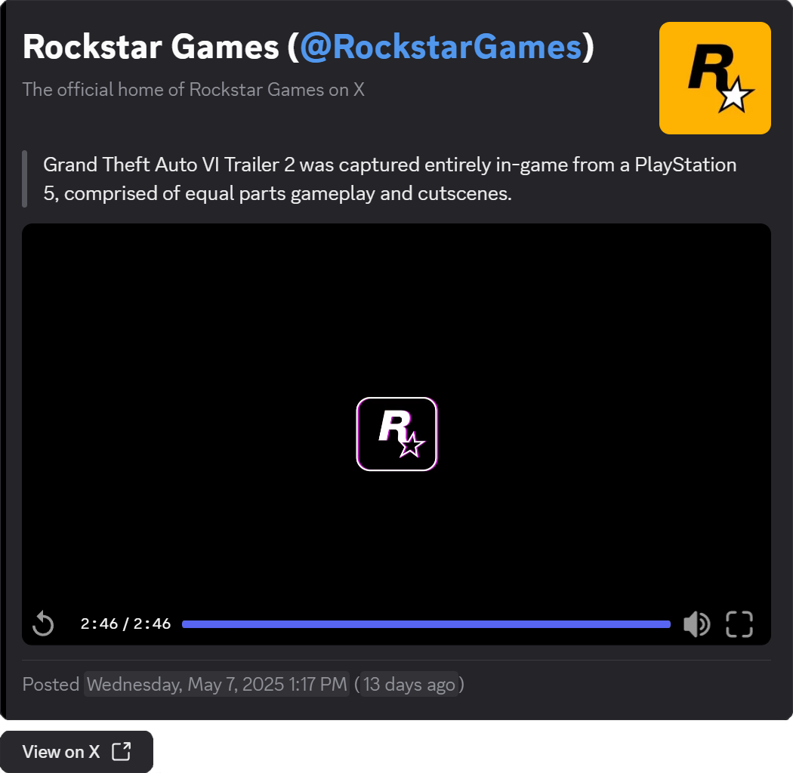

<div align="center">

# Bluebird

Bluebird tracks users on X (formerly Twitter) and sends post notifications to Discord.

[](https://www.python.org/)
[](https://github.com/EthanC/Bluebird/actions/workflows/workflow.yaml)

</div>



## Features

- Track several usernames and webhooks from one process.
- Filter notifications by media, keywords, replies, and reposts.
- Optionally route X links through a configurable proxy frontend.
- Render posts with Discord components, media galleries, and links back to X.
- Run from the published Docker container or directly with Python and `uv`.

## Docker Compose

Copy `config.example.toml` to `config.toml`, add your usernames and Discord webhook URLs, then create `compose.yaml` beside it:

```yaml
services:
  bluebird:
    container_name: bluebird
    image: ghcr.io/ethanc/bluebird:latest
    environment:
      LOG_LEVEL: INFO
      LOG_DISCORD_WEBHOOK_URL: https://discord.com/api/webhooks/YYYYYYYY/YYYYYYYY
      LOG_DISCORD_WEBHOOK_LEVEL: WARNING
    volumes:
      - ./config.toml:/bluebird/config.toml:ro
      - ./state.toml:/bluebird/state.toml
    restart: unless-stopped
```

Start the container:

```console
docker compose up -d
```

`LOG_DISCORD_WEBHOOK_URL` is optional. It sends Bluebird's own warning and error logs to a separate Discord webhook; post notifications use the webhooks in `config.toml`.

## Python

Python 3.14 or newer and [`uv`](https://docs.astral.sh/uv/) are required.

```console
uv sync
```

Copy `config.example.toml` to `config.toml` and edit it. To change logging, also copy `.env.example` to `.env`; all three environment variables are optional.

Run Bluebird from the repository root:

```console
uv run bluebird.py
```

Bluebird creates `state.toml` on startup. The first successful profile check records the newest post as the starting cursor; notifications begin with posts published afterward.

## Configuration

Each `[[instances.x]]` table defines one polling loop, one or more usernames, and a destination webhook. Add another table when accounts need a different webhook, schedule, or filter set.

```toml
[instances]

[[instances.x]]
usernames = ["RockstarGames", "CallofDuty"]
discord_webhook_url = "https://discord.com/api/webhooks/XXXXXXXX/XXXXXXXX"
require_keyword = ["trailer", "announcement"]
exclude_reply = true
cooldown = 900
proxy = true
```

| Key | Description | Type | Required | Default |
| --- | --- | --- | :---: | --- |
| `usernames` | X usernames to track, without `@` | String array | Yes | None |
| `discord_webhook_url` | Discord webhook that receives post notifications | String | Yes | None |
| `cooldown` | Minimum seconds to wait after all usernames are checked | Number | No | `60` |
| `require_media` | Send only posts that contain media | Boolean | No | `false` |
| `require_keyword` | Send only posts containing at least one listed substring; case-insensitive | String array | No | `[]` |
| `exclude_reply` | Skip replies | Boolean | No | `false` |
| `exclude_repost` | Skip reposts | Boolean | No | `false` |
| `exclude_keyword` | Skip posts containing any listed substring; case-insensitive | String array | No | `[]` |
| `proxy` | Replace navigational X links with proxy links; excludes media | Boolean | No | `false` |
| `proxy_host` | Hostname used for proxy links; requires `proxy = true` | String | No | `"xcancel.com"` |
| `proxy_name` | Proxy name used by the outbound button; requires `proxy = true` | String | No | `"XCancel"` |
